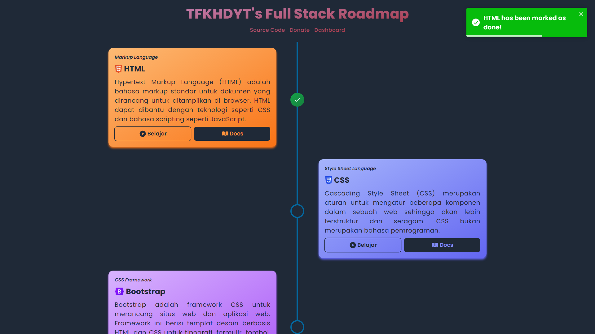
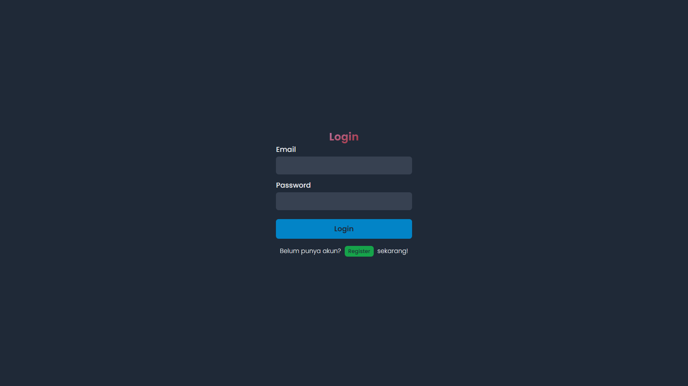
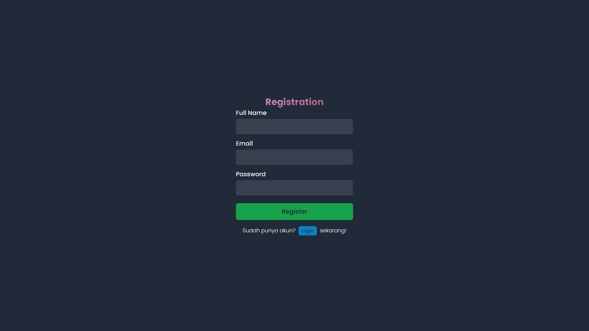
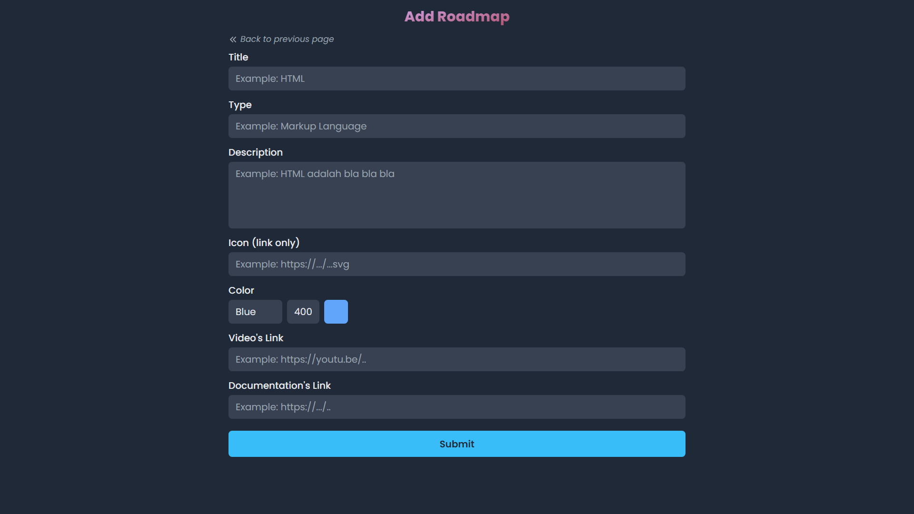

<div id="top"></div>
<!--
*** Thanks for checking out the Best-README-Template. If you have a suggestion
*** that would make this better, please fork the repo and create a pull request
*** or simply open an issue with the tag "enhancement".
*** Don't forget to give the project a star!
*** Thanks again! Now go create something AMAZING! :D
-->

<!-- PROJECT SHIELDS -->
<!--
*** I'm using markdown "reference style" links for readability.
*** Reference links are enclosed in brackets [ ] instead of parentheses ( ).
*** See the bottom of this document for the declaration of the reference variables
*** for contributors-url, forks-url, etc. This is an optional, concise syntax you may use.
*** https://www.markdownguide.org/basic-syntax/#reference-style-links
-->

[![Contributors][contributors-shield]][contributors-url]
[![Forks][forks-shield]][forks-url]
[![Stargazers][stars-shield]][stars-url]
[![Issues][issues-shield]][issues-url]
[![MIT License][license-shield]][license-url]
[![LinkedIn][linkedin-shield]][linkedin-url]

<!-- PROJECT LOGO -->
<br />
<div align="center">
<h3 align="center">Full Stack Roadmap</h3>

  <p align="center">
    Sebuah website yang menampilkan rekomendasi roadmap untuk full stack developer ala TFKHDYT
    <br />
    <a href="https://github.com/tfkhdyt/full-stack-roadmap"><strong>Explore the docs »</strong></a>
    <br />
    <br />
    <a href="https://roadmap.tfkhdyt.my.id">View Demo</a>
    ·
    <a href="https://github.com/tfkhdyt/full-stack-roadmap/issues">Report Bug</a>
    ·
    <a href="https://github.com/tfkhdyt/full-stack-roadmap/issues">Request Feature</a>
  </p>
</div>

<!-- ABOUT THE PROJECT -->

## About The Project








Website ini menampilkan roadmap full stack ala saya sendiri mulai dari dasar sampai expert. Data dari roadmap diambil dari API yang saya buat khusus agar proses tambah, edit, dan hapus data lebih mudah.

<p align="right">(<a href="#top">back to top</a>)</p>

### Built With

- [Next.js](https://nextjs.org/)
- [React.js](https://reactjs.org/)
- [Express.js](http://expressjs.com/)
- [Animate.css](https://animate.style/)
- [Axios](https://axios-http.com/)
- [SweetAlert2](https://sweetalert2.github.io/)
- [Universal Cookie](https://www.npmjs.com/package/universal-cookie)
- [SWR](https://swr.bootcss.com/en-US)
- [bcrypt](https://www.npmjs.com/package/bcrypt)
- [JWT](https://www.npmjs.com/package/jsonwebtoken)
- [Mongoose](https://mongoosejs.com/)

<p align="right">(<a href="#top">back to top</a>)</p>

## Environment Variables

- Client
  - `NEXT_PUBLIC_API_URL` = Link dari API
- Server
  - `PORT` = Port untuk server
  - `MONGODB_USERNAME` = Username MongoDB Atlas
  - `MONGODB_PWD` = Password MongoDB Atlas
  - `MONGODB_DATABASE` = Nama database MongoDB Atlas
  - `API_SECRET` = Secret word untuk JWT

<!-- GETTING STARTED -->

## Getting Started

- [Git](https://git-scm.com/)
- [Node.js](https://nodejs.org/en/)
- NPM
  ```sh
  npm install npm@latest -g
  ```

### Installation

1. Clone repo
   ```sh
   git clone https://github.com/tfkhdyt/full-stack-roadmap.git
   ```
2. Buka direktori repo
   ```sh
   cd full-stack-roadmap
   ```
3. Instal paket NPM yang dibutuhkan

   ```sh
   # client
   cd client
   npm install

   # server
   cd server
   npm install
   ```

4. Jalankan aplikasi dalam mode development

   ```sh
   # client
   cd client
   npm run dev

   # server
   cd server
   npm run dev
   ```

<p align="right">(<a href="#top">back to top</a>)</p>

<!-- USAGE EXAMPLES -->

## Usage

### Client

- Jalankan aplikasi dalam mode development
  ```sh
  npm run dev
  ```
- Build aplikasi
  ```sh
  npm run build
  ```
- Jalankan aplikasi dalam mode production
  ```sh
  npm run start
  ```

### Server

- Jalankan aplikasi
  ````sh
  npm run dev
  ```start
  ````

<p align="right">(<a href="#top">back to top</a>)</p>

## Contributing

Contributions are what make the open source community such an amazing place to learn, inspire, and create. Any contributions you make are **greatly appreciated**.

If you have a suggestion that would make this better, please fork the repo and create a pull request. You can also simply open an issue with the tag "enhancement".
Don't forget to give the project a star! Thanks again!

1. Fork the Project
2. Create your Feature Branch (`git checkout -b feature/AmazingFeature`)
3. Commit your Changes (`git commit -m 'Add some AmazingFeature'`)
4. Push to the Branch (`git push origin feature/AmazingFeature`)
5. Open a Pull Request

<p align="right">(<a href="#top">back to top</a>)</p>

<!-- LICENSE -->

## License

Distributed under the GPL-3.0. See [`LICENSE`](https://github.com/tfkhdyt/full-stack-roadmap/blob/main/LICENSE) for more information.

<p align="right">(<a href="#top">back to top</a>)</p>

<!-- CONTACT -->

## Contact

<p align=center>
  <a href="https://facebook.com/tfkhdyt142"></a>&nbsp;
  <a href="https://twitter.com/tfkhdyt"></a>&nbsp;
  <a href="https://instagram.com/_tfkhdyt_"></a>&nbsp;
  <a href="https://youtube.com/tfkhdyt"></a>&nbsp;
  <a href="https://t.me/tfkhdyt"></a>&nbsp;
  <a href="https://www.linkedin.com/mwlite/in/taufik-hidayat-6793aa200"></a>
  <a href="https://pddikti.kemdikbud.go.id/data_mahasiswa/QUUyNzdEMjktNDk0Ri00RTlDLUE4NzgtNkUwRDBDRjIxOUNB"></a>
  <a href="https://tfkhdyt.my.id/"></a>
</p>

Email: tfkhdyt@pm.me

Project Link: [https://github.com/tfkhdyt/full-stack-roadmap](https://github.com/tfkhdyt/full-stack-roadmap)

<p align="right">(<a href="#top">back to top</a>)</p>

<!-- MARKDOWN LINKS & IMAGES -->
<!-- https://www.markdownguide.org/basic-syntax/#reference-style-links -->

[contributors-shield]: https://img.shields.io/github/contributors/tfkhdyt/full-stack-roadmap.svg?style=for-the-badge
[contributors-url]: https://github.com/tfkhdyt/full-stack-roadmap/graphs/contributors
[forks-shield]: https://img.shields.io/github/forks/tfkhdyt/full-stack-roadmap.svg?style=for-the-badge
[forks-url]: https://github.com/tfkhdyt/full-stack-roadmap/network/members
[stars-shield]: https://img.shields.io/github/stars/tfkhdyt/full-stack-roadmap.svg?style=for-the-badge
[stars-url]: https://github.com/tfkhdyt/full-stack-roadmap/stargazers
[issues-shield]: https://img.shields.io/github/issues/tfkhdyt/full-stack-roadmap.svg?style=for-the-badge
[issues-url]: https://github.com/tfkhdyt/full-stack-roadmap/issues
[license-shield]: https://img.shields.io/github/license/tfkhdyt/full-stack-roadmap.svg?style=for-the-badge
[license-url]: https://github.com/tfkhdyt/full-stack-roadmap/blob/master/LICENSE
[linkedin-shield]: https://img.shields.io/badge/-LinkedIn-black.svg?style=for-the-badge&logo=linkedin&colorB=555
[linkedin-url]: https://linkedin.com/in/taufik-hidayat-6793aa200
[product-screenshot]: images/screenshot.png
